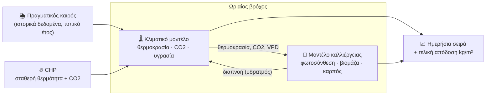

# Greenhouse Digital Twin

Ψηφιακό δίδυμο (digital twin) για θερμοκήπιο υδροπονίας τομάτας με μηχανή
συμπαραγωγής (CHP). Δίνεις τις πραγματικές παραμέτρους ενός θερμοκηπίου —
εμβαδόν, μόνωση, ισχύ CHP, ποικιλία, πυκνότητα φύτευσης — και το μοντέλο
προσομοιώνει μια ολόκληρη καλλιεργητική περίοδο ώρα-προς-ώρα, δείχνοντας πώς
εξελίσσεται το εσωτερικό μικροκλίμα και πόση τομάτα βγαίνει στο τέλος.

Η προσομοίωση τρέχει πάνω σε **πραγματικά ιστορικά δεδομένα καιρού** (όχι
τυχαία ή γενικευμένα) για την περιοχή του θερμοκηπίου, ώστε το αποτέλεσμα να
αντανακλά τις πραγματικές εποχιακές συνθήκες — κρύους χειμώνες, καυτά
καλοκαίρια — και όχι μια εξιδανικευμένη μέση κατάσταση.

## Τι κάνει το μοντέλο

Κάθε ώρα της προσομοίωσης, το μοντέλο απαντά σε δύο ερωτήματα ταυτόχρονα:

**Πώς αντιδράει το κλίμα του θερμοκηπίου;** Ο ήλιος ζεσταίνει τον αέρα μέσα
από το κάλυμμα, η θερμότητα χάνεται προς τα έξω ανάλογα με τη μόνωση, η
θέρμανση από τη μηχανή CHP καλύπτει το έλλειμμα, ο αερισμός αδειάζει την
περίσσεια ζέστη, η θερμοκουρτίνα κλείνει αυτόματα όποτε συμφέρει (νύχτα, πολύ
ζέστη, ή κρύο με ανεπαρκή θέρμανση), και — αν το θερμοκήπιο διαθέτει σύστημα
fan-pad — ο αέρας ψύχεται εξατμιστικά πριν μπει μέσα. Παράλληλα η CHP δίνει
CO2 από τα καυσαέρια της για εμπλουτισμό, και η υγρασία ρυθμίζεται μέσω
αερισμού, συμπύκνωσης στο κρύο κάλυμμα και ενεργής αφύγρανσης.

**Πόσο μεγαλώνει η καλλιέργεια;** Το φυτό φωτοσυνθέτει ανάλογα με το φως, το
CO2, τη θερμοκρασία και την υγρασία εκείνης της ώρας, χτίζοντας βιομάζα που
μοιράζεται μεταξύ βλαστικής ανάπτυξης και καρπού. Η γονιμοποίηση του άνθους
(αν θα γίνει τελικά καρπός) έχει τη δική της, στενότερη ευαισθησία στη
θερμοκρασία — ένα κρύο ή πολύ ζεστό βράδυ μπορεί να «χαλάσει» τη γονιμοποίηση
ακόμα κι αν η φωτοσύνθεση δεν επηρεάστηκε καθόλου.

Οι δύο πλευρές τροφοδοτούν η μία την άλλη κάθε ώρα: το κλίμα καθορίζει πόσο
φωτοσυνθέτει το φυτό, και το φυτό (μέσω της διαπνοής του) επηρεάζει την
υγρασία του αέρα.

**Βασική αρχή σχεδιασμού:** η ηλεκτρική έξοδος της CHP είναι **σταθερή**
(καθορίζεται από το δίκτυο, όχι από τις ανάγκες του θερμοκηπίου) — άρα και η
θερμότητα και το CO2 που παράγει είναι επίσης σταθερά. Το θερμοκήπιο παίρνει
όση θερμότητα/CO2 χρειάζεται· η περίσσεια πάει χαμένη (dump θερμότητας, bypass
CO2 στην ατμόσφαιρα). Η CHP δεν προσαρμόζεται ποτέ στις ανάγκες του
θερμοκηπίου.

## Δες το live

Το μοντέλο τρέχει πίσω από ένα web interface: σέρνεις sliders (θερμοκρασίες,
CO2, υγρασία, πυκνότητα φύτευσης, διάρκεια) και βλέπεις σε πραγματικό χρόνο
πώς αλλάζει η τελική παραγωγή και τα ημερήσια διαγράμματα θερμοκρασίας, CO2,
υγρασίας, ενεργειακής κατανάλωσης και ωρών κλειστής θερμοκουρτίνας. Μετά την
εκτέλεση, ένας day-scrubber σε αφήνει να «προχωρήσεις» σε οποιαδήποτε ημέρα
της ήδη προσομοιωμένης περιόδου (π.χ. ημέρα 10, 100, 200) — το διάγραμμα
τομής, οι μετρητές και όλα τα διαγράμματα ακολουθούν την επιλεγμένη ημέρα.
Πρώτο βήμα προς ένα μελλοντικό digital twin που θα «προχωράει» παράλληλα με
το πραγματικό θερμοκήπιο, μία πραγματική μέρα τη φορά.

## Αρχιτεκτονική μοντέλου



Δες το πλήρες, αναλυτικό διάγραμμα καλωδίωσης (κάθε παράμετρος, πού πηγαίνει,
ποια μπλοκ επηρεάζει) στο [`docs/model-map.html`](./docs/model-map.html).

## Βασικές εξισώσεις

Οι παρακάτω είναι οι πυρήνες των δύο μοντέλων — απλοποιημένες, βιβλιογραφικά
εμπνευσμένες εκδοχές πραγματικών ακαδημαϊκών μοντέλων (**GreenLight** για το
κλίμα, **TOMGRO** για την καλλιέργεια), όχι πιστά ports.

**Ενεργειακό ισοζύγιο θερμοκηπίου** (ωριαίο):

```
ΔΘερμοκρασία = (Ηλιακό κέρδος − Απώλεια μόνωσης + Θέρμανση − Αερισμός) × Δt / Θερμοχωρητικότητα
```

Ο αερισμός λειτουργεί σαν θερμοστάτης: αυξάνεται όσο η θερμοκρασία ξεπερνά το
setpoint, αλλά **σταματάει** μόλις φτάσει τον στόχο — δεν αδειάζει τη
θερμότητα μέχρι να εξισωθεί με το εξωτερικό αέρα.

**Φωτοσύνθεση κόμης** (ολοκλήρωμα Beer-Lambert πάνω σε καμπύλη κορεσμού
φωτός, ώστε τα κατώτερα φύλλα να μετράνε σωστά το λιγότερο φως λόγω σκίασης
από τα πάνω φύλλα):

```
Φωτοσύνθεση = Pmax × f(φως, LAI) × f(CO2) × f(θερμοκρασία) × f(υγρασία-VPD)
```

Κάθε `f(...)` είναι μια καμπύλη απόκρισης μεταξύ 0 και 1 — μηδέν έξω από το
βιώσιμο εύρος, μέγιστο στο βέλτιστο σημείο. Η γονιμοποίηση του καρπού
χρησιμοποιεί **δική της, στενότερη** καμπύλη θερμοκρασίας (η βιωσιμότητα της
γύρης είναι πολύ πιο ευαίσθητη στη θερμοκρασία από την ίδια τη φωτοσύνθεση).

**Ισοζύγιο βιομάζας:**

```
Καθαρή ανάπτυξη = Φωτοσύνθεση − Αναπνοή συντήρησης
Καρπός += Καθαρή ανάπτυξη × ποσοστό-διαμερισμού-καρπού × ποιότητα-γονιμοποίησης
```

## Περιορισμοί του μοντέλου

- **Καμία πρόβλεψη ασθενειών** — δεν υπάρχει μοντέλο κινδύνου για ωίδιο,
  Botrytis κ.ά., παρόλο που η υγρασία/VPD υπολογίζονται ήδη (προαπαιτούμενο
  για ένα τέτοιο module στο μέλλον).
- **Ένα μόνο θερμικό ζώνη** — δεν μοντελοποιείται χωρική διαφοροποίηση μέσα
  στο θερμοκήπιο (π.χ. διαφορά κοντά στα τοιχώματα).
- **Χωρίς πραγματικά δεδομένα αισθητήρων** — οι παράμετροι φωτοσύνθεσης/
  ανάπτυξης είναι βιβλιογραφικά τυπικές τιμές για θερμοκηπιακή τομάτα, όχι
  βαθμονομημένες σε αυτό το συγκεκριμένο θερμοκήπιο.
- **Καμία γήρανση/φυλλόπτωση** — τα φυτά δεν χάνουν μόνιμα βιομάζα με την
  ηλικία (πέρα από την καθημερινή αναπνοή που ήδη μοντελοποιείται), κάτι που
  θα έπαιζε ρόλο σε πολύ μεγάλες καλλιεργητικές περιόδους.
- **Σταθερό ωράριο ημέρας/νύχτας** — δεν συνδέεται με την πραγματική
  ανατολή/δύση ήλιου του γεωγραφικού πλάτους και της εποχής.
- **Υδροπονία**: `hydroponic.system_type: "drip_substrate"` (rockwool), με πραγματική
  μοντελοποίηση fertigation (νερό/ρεύμα/λίπασμα από το transpiration, βλ.
  `docs/assumptions/hydroponics.md` Level A). Level B πάνω στο marketable yield: EC→ξηρή
  ουσία καρπού + καμπανοειδές risk (peak στο EC=3.0 mS/cm, συνεχής πτώση προς BER σε υψηλό EC
  ή έλλειψη θρεπτικών σε χαμηλό EC — καμία flat ζώνη), pH→διαθεσιμότητα θρεπτικών (ίδιο
  σχήμα, peak ακριβώς στο pH=5.5), και N/K/Mg/B recipe adequacy — όλα interactive sliders στο
  tab «Συνταγή γεωπονίας», και το marketable yield φαίνεται συνεπές σε όλα τα tabs (όχι μόνο
  εκεί). Ό,τι δεν αναφέρθηκε (P/S/Fe/Mn/Zn/Cu/Mo) παραμένει πληροφοριακό, χωρίς μοντελοποίηση.
- **Το κλίμα είναι phase-aware μόνο για θερμοκρασία (2026-08-31)** — τα setpoints
  θέρμανσης ημέρας/νύχτας αλλάζουν πλέον ανά φάση καλλιέργειας (βλαστική / ramp-up /
  πλήρης καρποφορία, ίδιο boundary με `fruiting_start_days`/`fruiting_ramp_days`),
  με ~2°C θερμότερο target στην καρποφορία (βιβλιογραφικά τεκμηριωμένο). Το CO2
  setpoint και ο στόχος αφύγρανσης παραμένουν σταθερά σε όλη τη διάρκεια — ίδιο
  μοτίβο, επόμενο βήμα.

## Τι σχεδιάζουμε για το μέλλον

- **Πραγματική βαθμονόμηση** με δεδομένα αισθητήρων και πραγματικής
  παραγωγής, μόλις γίνουν διαθέσιμα — οι σημερινές τιμές είναι το καλύτερο
  βιβλιογραφικό σημείο εκκίνησης, όχι τελικές.
- **Module πρόβλεψης ασθενειών**, πάνω στα ήδη υπάρχοντα υγρασία/VPD.
- **Multi-zone κλιματικό μοντέλο**, αν χρειαστεί χωρική ανάλυση.
- **Layer βελτιστοποίησης/ελέγχου** (rule-based ή μαθησιακός controller) πάνω
  από το σημερινό, καθαρά περιγραφικό μοντέλο.
- **Πραγματική συνταγή γεωπονίας**: φορτίο ταξιανθιών/κλάδεμα (crop load
  management) και ρυθμός αφαίρεσης φύλλων ως πραγματικές παράμετροι, όχι μόνο
  το κλίμα-στόχος που υπάρχει σήμερα.
- **Phase-aware κλιματικό μοντέλο, CO2/αφύγρανση**: το ίδιο μοτίβο baseline+delta
  που μόλις υλοποιήθηκε για τη θερμοκρασία (2026-08-31), επεκτεινόμενο σε
  `co2_setpoint_day_ppm` και `dehumidification_setpoint_pct` — **επόμενο βήμα**,
  δεν έχει ξεκινήσει. Βλ. `docs/plans/2026-08-31-phase-aware-climate-design.md`.
- **Level D υδροπονίας**: ML-based αναβαθμονόμηση των placeholder συντελεστών
  (π.χ. τα damped-tier slopes/caps) μόλις υπάρξουν πραγματικά δεδομένα
  αισθητήρων/παραγωγής από το πραγματικό θερμοκήπιο — βλ.
  `docs/assumptions/hydroponics.md`, καταγεγραμμένο, όχι ενεργό work item.
- **Συμπληρωματικός φωτισμός βάσει DLI** (daily light integral), αν προστεθεί
  τεχνητός φωτισμός στο θερμοκήπιο.

## Τεκμηρίωση παραδοχών

Κάθε αριθμός στο μοντέλο (βιβλιογραφικός, εκτίμηση μηχανικού, ή
συγκεκριμένος για αυτό το θερμοκήπιο) είναι καταγεγραμμένος με πηγή στο
[`docs/`](./docs/) — δες [`docs/assumptions/README.md`](./docs/assumptions/README.md)
για τον πλήρη οδηγό, ή [`docs/sources.xlsx`](./docs/sources.xlsx) για το
συγκεντρωτικό πίνακα.
